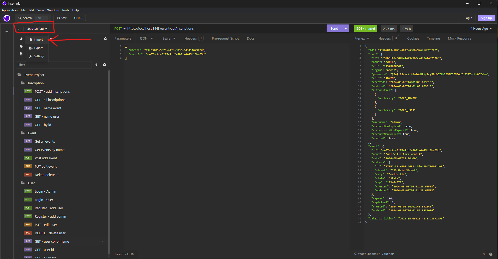

# eventProject

### Tecnologias usadas:

* *Java 17*
* *Spring Boot 3.2.2*
* *PostgreSql 16*
* *maven 4.0.0*

### Recursos existese no projeto:

* Autentificação por __JWT__
* Certificado __SSL__
* Documenttação da Api com __SpringDoc OpenAPI__
* Testes unitarios e de Integração com __Junit 5__ e __Mokito__

### Ferramentas ultilizadas:

* IntelliJ IDEA Community Edition 2022.2
* PgAdmin 4 (Para a banco de dados Postgresql durante o desevolvimento)
* Insomnia (Para testar aplicação requisição)

### Instalação

#### Rode o banco de dados PostgreSQL, pode ser pelo PgAdmin 4 ou usando um contêiner Docker com uma imagem do banco PostgreSQL, vai se dua preferencia 

#### clone o projeto e baixe as dependências (com o comando abaixo ou pela IDE de seu gosto)

> mvn clean install

#### Execute aplicação (com o comando abaixo ou pela IDE de seu gosto)

> mvn spring-boot:run

#### __caso ocorra algum problema a instalação das dependências ou na execução__, fique atendo a sua versão do java ou da versão do java da sua IDE, o projeto está configurado para rodar com o __Java 17__.


### Documentação da aplicação:

#### Aplicação possui o swagger (*link abaixo*) detalhando cada rota, no qual também é possível realizar os testes através do mesmo.

> Link do Swagger `https://localhost:8443/event-api/swagger-ui/index.html#/`


### Testes via API

> URL para cadrastro de novo usuario -  `https://localhost:8443/event-api/auth/register` 

#### Exemplo de objeto do tipo usuario para a requisição POST de __register__

```
{
	"name": "admin",
	"cpf": "12345678901",
	"login": "admin",
	"password": "senha123",
	"role": "ADMIN",
	"created": null,
	"updated": null
}
```

> URL para login - `https://localhost:8443/event-api/auth/login`

#### Exemplo de objeto para a geração do Token na requisição POST __login__

```
{
	"login": "admin",
	"password": "senha123" 
}
```

#### Dentro do projeto no caminho `eventProject/datas/json/Insomnia_2024-05-06.json` há um JSON que pode ser importado ao seu __**Insomnia**__ para realizar os demais testes da API

 


